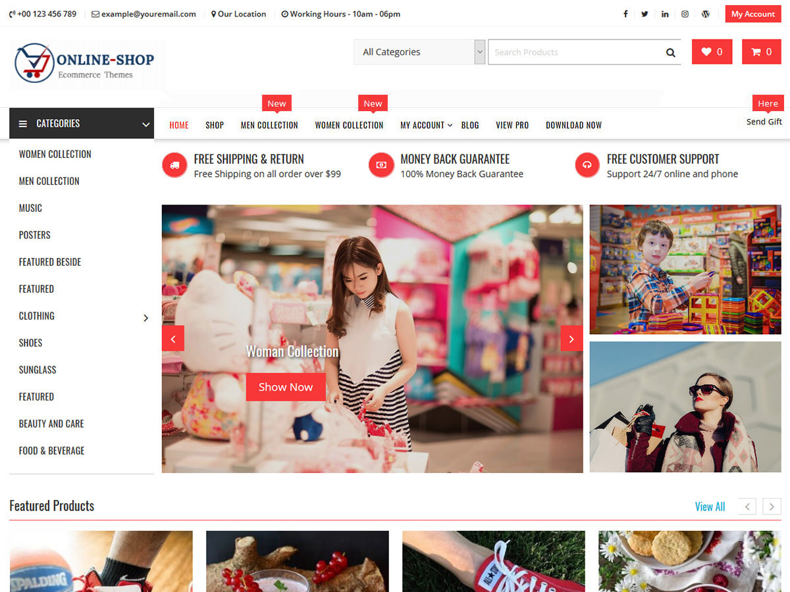

# Online Shop

**Contributors:** acmethemes  
**Requires at least:** 6.6  
**Tested up to:** 7.0  
**Requires PHP:** 7.4  
**Stable tag:** 4.0.0  
**License:** GPLv2 or later  
**License URI:** https://www.gnu.org/licenses/gpl-2.0.html  

> 

Online Shop is a powerful e-commerce WordPress theme built to create any kind of online store. Fashion, electronics, jewelry, digital products, or a general marketplace — its deep WooCommerce integration and highly customizable options make it a perfect fit for merchants who want a professional, conversion-focused storefront.

## Features

- **WooCommerce compatible** — full product, cart, and checkout support
- **Advanced slider** — feature products, promotions, and seasonal offers
- **Featured category posts** — highlight product categories on the homepage
- **Sticky menu** — navigation stays visible while customers browse
- **Sticky sidebar** — cart or filters follow the scroll
- **Special menu options** — promotional menu items and badges
- **Advertisement options** — banner slots for promotions
- **Flexible header** — logo, search, cart icon, and more
- **Footer widgets** — links, contact, payment icons, and social
- **Up to four-column layouts** — product grid flexibility
- **Custom colors & background** — match your brand
- **Editor-style support** — consistent editing experience
- **Translation ready** — .pot file included
- **RTL support** — right-to-left language compatible
- **Responsive** — optimized for mobile shopping

## Installation

1. Download the theme zip file.
2. In your WordPress admin, go to **Appearance → Themes**.
3. Click **Add New** → **Upload Theme**.
4. Select the zip file and click **Install Now**.
5. Click **Activate**.

## Frequently Asked Questions

### How do I set up the WooCommerce pages?

After activating the theme, WooCommerce will prompt you to create the required pages (shop, cart, checkout, my account). Follow the wizard to set up your store.

### How do I feature products on the slider?

Go to **Appearance → Customize → Slider Options** and select which products or categories to display.

## Credits

Online Shop is built on [Underscores](https://underscores.me/) and licensed under GPLv2 or later. It bundles the following third-party resources:

- [Google Fonts](https://fonts.google.com/) — Apache License 2.0
- [Font Awesome](https://fontawesome.com/) — MIT / SIL OFL 1.1
- [normalize.css](https://necolas.github.io/normalize.css/) — MIT
- [Bootstrap](http://getbootstrap.com/) — MIT
- [Theia Sticky Sidebar](https://github.com/WeCodePixels/theia-sticky-sidebar) — MIT
- [Breadcrumb Trail](https://github.com/justintadlock/breadcrumb-trail) — GPLv2+
- [TGM Plugin Activation](http://tgmpluginactivation.com/) — GPLv2+
- [html5shiv](https://github.com/afarkas/html5shiv) — MIT
- [Respond.js](https://github.com/scottjehl/Respond) — MIT
- [SlickNav](https://github.com/ComputerWolf/SlickNav) — MIT

---

[Demo](http://demo.acmethemes.com/online-shop) &middot; [Support](https://www.acmethemes.com/supports/) &middot; [Acme Themes](https://www.acmethemes.com)
